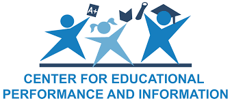
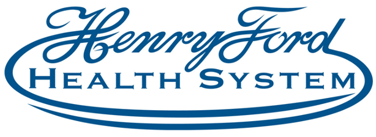
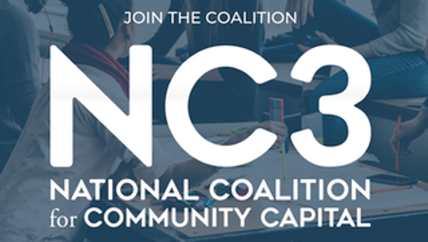
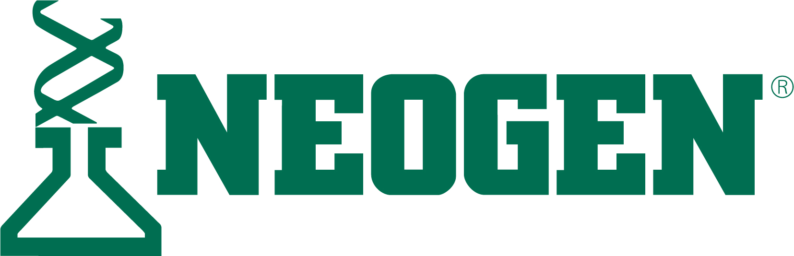
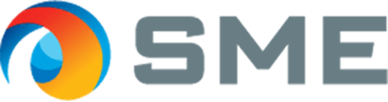

# Spring 2023 Project Sponsors

The following list includes links to our Spring 2023 project sponsor's and their websites.  Michigan State University and the Department of Computational Mathematics Science and Engineering would like to thank these generous sponsors for supporting our students. 

All of the sponsor logos presented here and elsewhere in this website are the property of those respective organizations and are used with their permission. 

| | 
|:---|
|  |
|  | 
|  | 
|  | 
|  | 
|   | 
| [**_The Department of Kinesiology_** ](https://education.msu.edu/kin/) | 
|  | 
|   |
| **_The QSIDE Institutue_**   
|   |
| 

